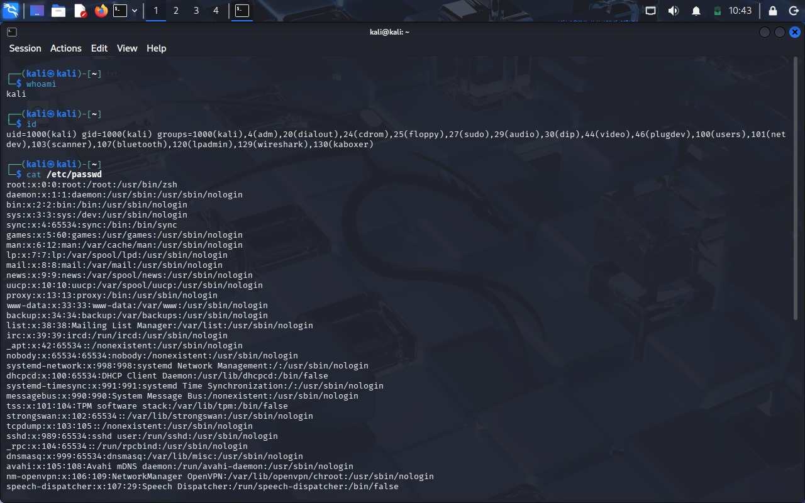
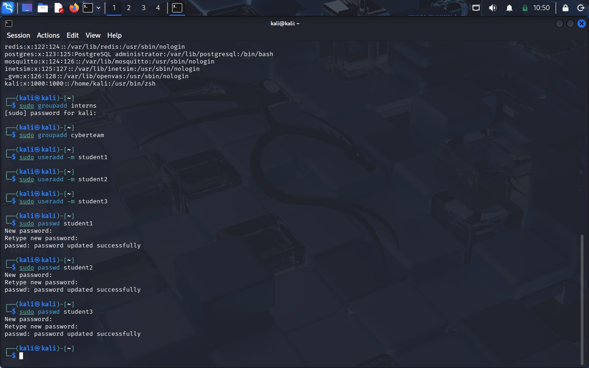
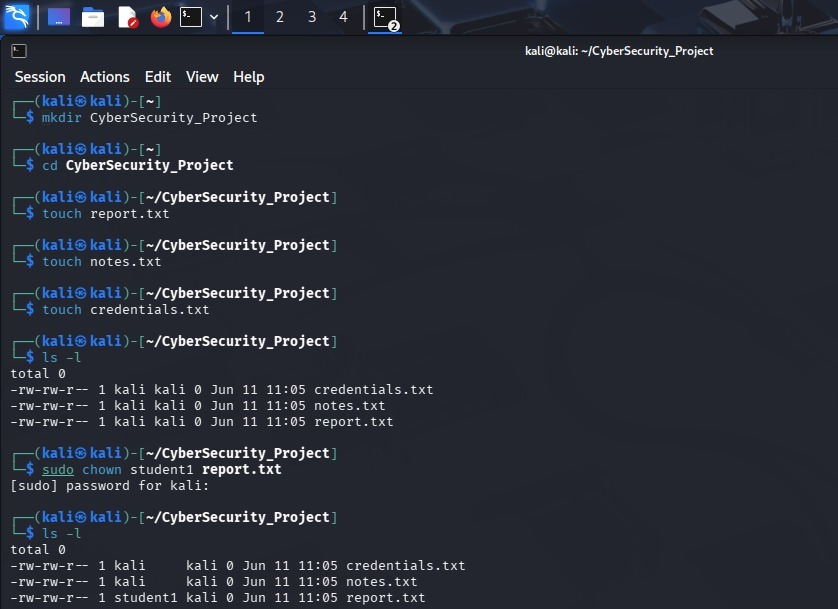
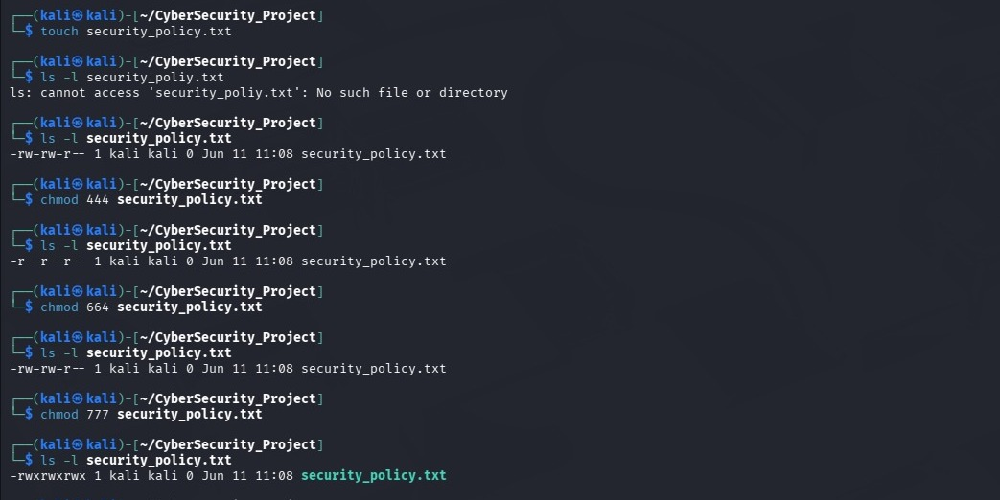

# Linux_Task_02_Meghana Users, Groups & File Permissions

## Name
Meghana S

## Objective

The objective of this task is to understand Linux user management, groups, ownership, and file permissions. These concepts are essential for Linux system administration and cybersecurity.

---

# Part A - Understanding Users

Commands Used:

```bash
whoami
id
cat /etc/passwd
```

### Findings

- Current Username: kali
- UID: Unique User ID assigned to the user.
- GID: Group ID assigned to the user's primary group.
- /etc/passwd contains information about system users including usernames, UIDs, GIDs, home directories, and login shells.

Screenshots:

- S1_whoami
- S1_id
- S1_passwd
  

---

# Part B - Create Users & Groups

Groups Created:

- interns
- cyberteam

Users Created:

- student1
- student2
- student3

Verification Commands:

```bash
groups student1
groups student2
groups student3

id student1
id student2
id student3
```

Screenshots:

- S2_groups.png
- S2_users.png
- 

---

# Part C - File Ownership

Folder Created:

```bash
CyberSecurity_Project
```

Files Created:

- report.txt
- notes.txt
- credentials.txt

Ownership Changed:

```bash
sudo chown student1 report.txt
```

### Ownership Information

| Item | Value |
|--------|--------|
| Original Owner | kali |
| New Owner | student1 |
| Command Used | sudo chown student1 report.txt |

Screenshots:

- S5_ownership_before.png
- S5_ownership_after.png
- 

---

# Part D - File Permissions

File Created:

```bash
security_policy.txt
```

Permissions Tested:

### Read Only

```bash
chmod 444 security_policy.txt
```

Result:

```text
-r--r--r--
```

### Read & Write

```bash
chmod 664 security_policy.txt
```

Result:

```text
-rw-rw-r--
```

### Full Access

```bash
chmod 777 security_policy.txt
```

Result:

```text
-rwxrwxrwx
```

Screenshots:

- S6_readonly.png
- S6_readwrite.png
- S6_fullaccess.png
- 

---

# Part E - Permission Analysis

| Permission | Meaning |
|------------|---------|
| 755 | Owner full access, others read and execute |
| 644 | Owner read/write, others read only |
| 777 | Everyone has full access |
| 600 | Only owner can read and write |
| 700 | Only owner has full access |

Detailed analysis is available in Permission_Analysis.txt.


---

# Part F - Security Challenge

| File | Permission | Reason |
|--------|--------|--------|
| password_backup.txt | 600 | Sensitive data |
| public_notice.txt | 644 | Publicly readable |
| system_log.txt | 640 | Restricted administrative access |
| personal_notes.txt | 600 | Private information |

Detailed explanations are available in Security_Challenge.txt.

---

# Part G - Linux Security Research

Topics Covered:

- Importance of File Permissions
- Risks of 777 Permissions
- Principle of Least Privilege
- Access Control in Organizations

Detailed answers are available in Research_Answers.txt.

---

# Folder Structure

```text
Linux_Task_02_StephenJ/
│
├── Screenshots/
│   ├── S1_whoami.png
│   ├── S1_id.png
│   ├── S1_passwd.png
│   ├── S2_groups.png
│   ├── S2_users.png
│   ├── S3_ownership_before.png
│   ├── S3_ownership_after.png
│   ├── S4_readonly.png
│   ├── S4_readwrite.png
│   └── S5_fullaccess.png
│
├── Commands_Used.txt
├── Permission_Analysis.txt
├── Security_Challenge.txt
├── Research_Answers.txt
└── README.md
```

---

# Conclusion

This task provided practical experience with Linux user management, groups, ownership, and file permissions. Understanding these concepts is important for maintaining secure Linux systems and implementing proper access control.
